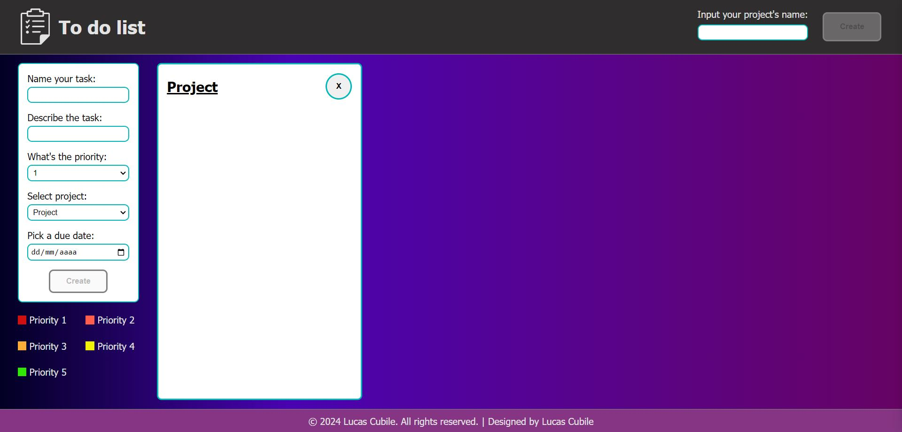
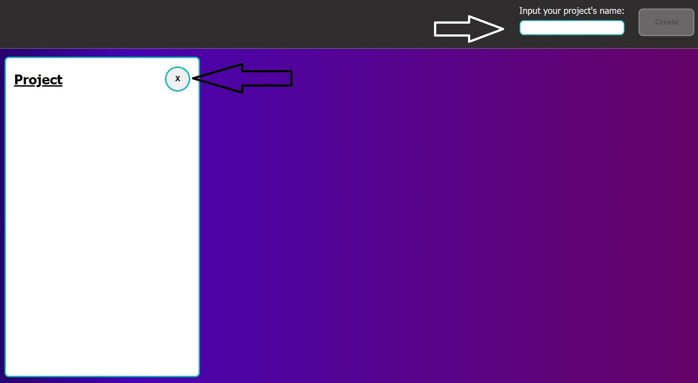
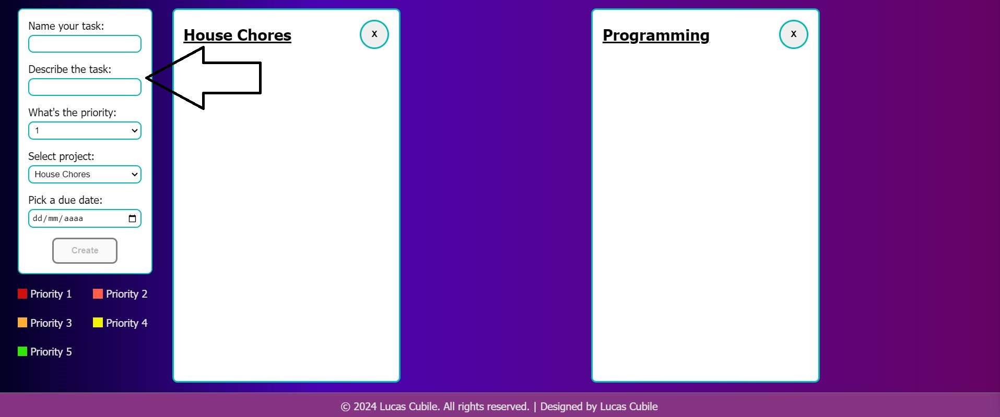
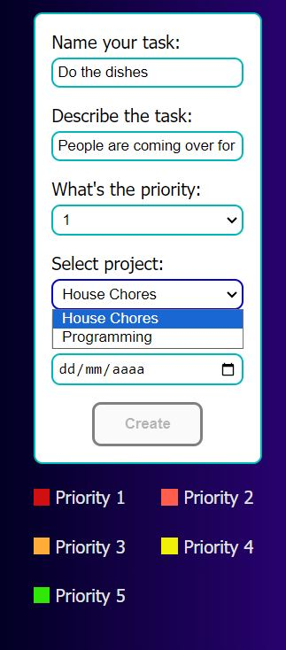
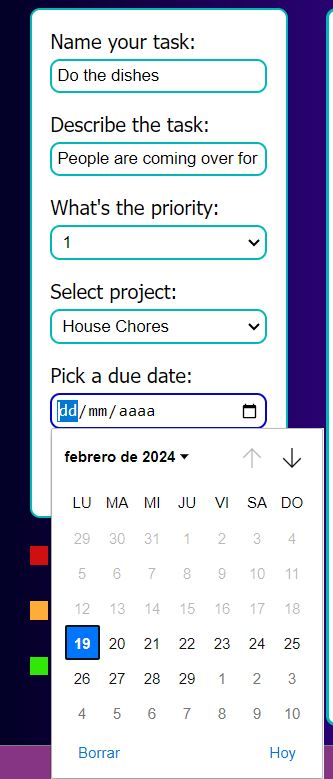
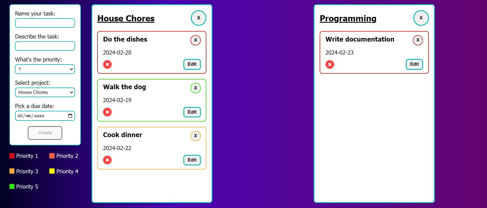
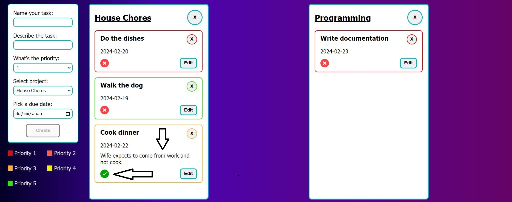
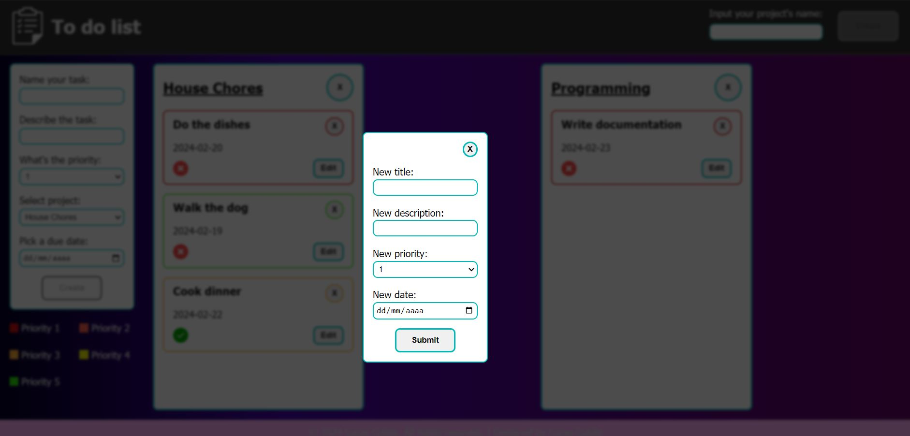

# To-do-list-js

A to do list project using vanilla JS with OOP.

# What the project is about

The project is a task manager to add tasks to do and assign them to different projects.

# What have I learned so far?

Unlike the previous restaurant page project which used mainly functional programming, this project uses classes in every part of the app in order to use a practical implementation of object oriented programming.

<ul>
  <li>Use of classes.</li>
  <li>Inheritance and method overriding.</li>
  <li>Private properties.</li>
  <li>Static methods.</li>
  <li>Persistence of data through localStorage.</li>
</ul>

# Want to see it in action?

<a href="https://hroglardev.github.io/To-do-list-js/" target="_blank">Click here</a>

# How to use the app.

The app starts with a basic template project to which you can add tasks should you wish to.

If you want to customize your own projects, you can create more by using the input at the top of the page and delete the template initial project.

Once you have your new projects you can use the sidebar's form to create tasks.

Fill the information and select the priority of the task (1 being top priority). You can check the priority reference below the creation form. Don't forget to select which project you would like to add the task to.

Select the due date for the task to be created.

Once you have created new tasks they are displayed in their respective projects with borders referencing their priority. You can use the X button at their corners to delete the task.

After completing the task you can toggle the completion by clicking on the red-cross icon. If you've made a mistake the toggle works both ways. When you hover over the task, its description is displayed to see the task in more detail.

If at any point you wish to edit any detail about any task, click on the edit button to trigger a form to edit as many details as needed. If the edit button was clicked by accident you can close the form by using the cross button at the form's corner.

# Want to track my progress?

Checkout my other projects in order to see my evolution:

<ol>
  <li><a href="https://github.com/hroglardev/odin-recipes" target="_blank">Recipes</a></li>
  <li><a href="https://github.com/hroglardev/Odin-landing-page" target="_blank">Landing Page</a></li>
  <li><a href="https://github.com/hroglardev/Rock-Paper-Scissors-TOP-Console" target="_blank">Console Rock, Paper, Scissors</a></li>
  <li><a href="https://github.com/hroglardev/Rock-Paper-Scissors-TOP" target="_blank">Rock, Paper, Scissors</a></li>
  <li><a href="https://github.com/hroglardev/Etch-a-Sketch" target="_blank">Etch a Sketch</a></li>
  <li><a href="https://github.com/hroglardev/Calculator" target="_blank">Calculator</a></li>
  <li><a href="https://github.com/hroglardev/Sign-up-form-TOP" target="_blank">Sign up form</a></li>
  <li><a href="https://github.com/hroglardev/Dashboard" target="_blank">Dashboard</a></li>
  <li><a href="https://github.com/hroglardev/Library" target="_blank">Library</a></li>
  <li><a href="https://github.com/hroglardev/Tic-tac-toe" target="_blank">Tic-tac-toe</a></li>
  <li><a href="https://github.com/hroglardev/Restaurant-page" target="_blank">Restaurant page</a></li>
  <li><a href="https://github.com/hroglardev/To-do-list-js" target="_blank">You are here</a></li>
  <li><a href="https://github.com/hroglardev/Weather-app" target="_blank">Weather app</a></li>
  <li><a href="https://github.com/hroglardev/Battleship" target="_blank">Battleship</a></li>
  <li><a href="https://github.com/hroglardev/Lucas-Cubile" target="_blank">Portfolio</a></li>
</ol>

These are all my projects in my basic section of my coding journey. I will continue with it in the React section along with back-end programming.

If you'd like to skip my basic projects and jump straight to the next section, you can jump to it in the following link.

<a href="https://github.com/hroglardev/CV-creator" target="_blank">React - Backend</a>
